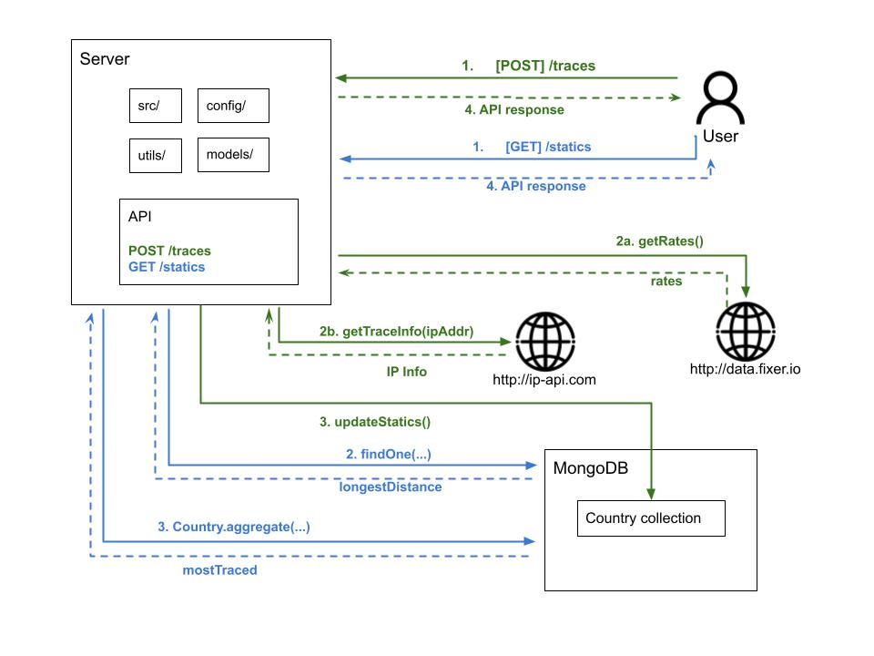

# IP Trace App
## _RESTful API to provide information about IP address._
Small app that allows a user to obtain information about an IP Geolocation and some statistics data.

## High Level Design
This app exposes two endpoints which are explained in details below. For getting information related to IP Geolocation,
this app wil communicate with https://ip-api.com and information about currencies with https://fixer.io/.

Finally, this app uses a Mongo collection to store statistics for each country like trace hits and distance.




## API Documentation
### POST /traces
Description: This endpoint will receive, via HTTP POST, an IP address in the format _123.123.123.123_, and return the following information associated with
that IP address:
* Country which issued the IP and its ISO code
* Coordinates for its location (latitude and longitude)
* An array of currencies for that country with:
    - ISO code (BRL, USD, UYU, ARS)
    - Symbol ($, £)
    - Conversion rate from currency to USD
* Distance between Uruguay and country of origin (in Kms) 

Body:
```json
{
  "ip": "167.62.158.169"
}
```
Response [200 OK]:
```json
{
  "ip": "192.99.47.146",
  "name": "Canada",
  "code": "CA",
  "lat": 45.5029,
  "lon": -73.5723,
  "currencies": [
    {
      "iso": "CAD",
      "symbol": "$",
      "conversion_rate": 1.2142143323394874
    },
    {
      "iso": "USD",
      "symbol": "$",
      "conversion_rate": 1
    }
  ],
  "distance_to_uy": 15660.673167886496
}
```    

### GET /statistics
A resource which, on an HTTP GET, returns:
* Longest distance from requested traces
* Most traced country

Response [200 OK]:
```json
{
  "longest_distance": {
    "country": "Argentina",
    "value": 19366.3844841955
  },
  "most_traced": {
    "country": [
      "Canada",
      "Argentina"
    ],
    "value": 4
  }
}
```

### Comments / Assumptions
- I assumed that it is not going to be the case that two countries have the same longest distance based on the large
   number of decimal places that this data contains. For this reason, I decided to use findOne().
- On the other hand, in the response of the most_traced country, there is a high probability that there is more than 
  one country with the same number of hits. If this happens, a list of countries will be part of the answer and not a 
  single country.
- In order to deal with expected throughput, this solution is adapted to be deployed into docker containers allowing 
  to build a high-concurrency environment.


### Technical Debts or Next Steps
I identified a list of improvements which were not applied due to lack of time but could be added in future iterations:
- Better management of responses, maybe adding a JSON builder.
- Adds border cases for UTs.
